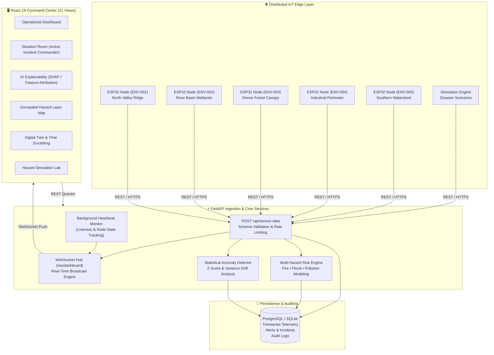

<div align="center">

# 🌍 TerraSentinel
### AI Environmental Monitoring Network & Multi-Hazard Early Warning System
**Smart India Hackathon (SIH) Problem Statement: SIH26178**

[](https://fastapi.tiangolo.com/)
[](https://react.dev/)
[](https://www.typescriptlang.org/)
[](https://www.postgresql.org/)
[](https://terrasentinel-backend-svj3.onrender.com/health)
[](https://vitejs.dev/)
[](https://tailwindcss.com/)

<p align="center">
  <b>A distributed, hardware-decoupled environmental intelligence platform combining low-cost edge sensors, real-time spatial AI risk modeling, spatiotemporal digital twins, and tactical incident response workflows.</b>
</p>

[Live Cloud API](https://terrasentinel-backend-svj3.onrender.com/docs) • [Architecture](#-end-to-end-architecture) • [21 Operational Views](#-platform-screens--command-center-views) • [IoT Firmware Specs](#-iot-edge-hardware-contract) • [Deployment](#-cloud-deployment-guide)

</div>

---

## 📌 Executive Summary

Environmental disasters—such as **wildfires**, **flash floods**, and **toxic industrial smog inversions**—frequently inflict devastating ecological and human casualties due to delayed detection. Conventional monitoring systems suffer from:
1. **High latency**: Offline sampling or manual spot-checks.
2. **Siloed parameters**: Monitoring only air quality without cross-referencing temperature, humidity, rainfall, and barometric trends.
3. **Black-box predictions**: Lack of feature explainability for incident commanders and emergency response teams.

**TerraSentinel** bridges this gap with an enterprise-grade, end-to-end IoT and AI monitoring framework that ingests continuous multi-variate telemetry, computes dynamic hazard ratings (0–100), detects sensor drift anomalies, and streams real-time threat projections to a high-contrast tactical command center.

---

## 🏗 End-to-End Architecture



---

## 🌟 Key Capabilities & Differentiators

| Feature | Description | Technical Implementation |
| :--- | :--- | :--- |
| **Hardware-Decoupled Contract** | Zero tight coupling between firmware and cloud. Hardware nodes and simulation generators use the exact same REST contract. | Stable Pydantic schema with coordinate validation and timestamp normalization. |
| **Multi-Hazard AI Engine** | Simultaneously models forest fire, flash flood, and air pollution risks using real-time atmospheric inputs and 30-minute rolling histories. | Multi-variate heuristic calculations designed as swappable interfaces for XGBoost/Random Forest models. |
| **Explainable AI (XAI)** | Eliminates black-box predictions by exposing exact percentage contributions for each environmental factor. | Dynamic attribution vectors quantifying thermal lift, fuel moisture deficit, and gas spikes. |
| **Spatiotemporal Digital Twin** | Interactive 4D timeline scrubbing allowing operators to replay environmental conditions leading up to an incident. | Historical timeseries regression querying database snapshots with time offsets. |
| **Zero-Latency Push** | Instantaneous telemetry and alert updates without client-side polling. | Dedicated FastAPI WebSocket Hub (`/ws/dashboard`) with client auto-reconnection and heartbeat pings. |
| **Graceful Zero-Config DB** | Connects to production PostgreSQL (e.g. Render) or seamlessly falls back to local SQLite with zero manual setup. | Dynamic SQLAlchemy 2.0 connection pool manager with auto-migration and node seeding. |

---

## 🖥️ Platform Screens & Command Center Views

TerraSentinel features **21 specialized views** organized into 6 operational domains:

```
TERRASENTINEL COMMAND CENTER
├── 1. OVERVIEW & COMMAND
│   ├── 01. DashboardView              → Comprehensive fleet KPI ribbon, live map, alerts & fleet table
│   ├── 02. SituationRoomView          → Active disaster response room, hazard hierarchy & evacuation zone
│   └── 03. LiveMonitoringView         → High-frequency multi-sensor telemetry stream & raw metrics
│
├── 2. INTELLIGENCE & OBSERVABILITY
│   ├── 04. AiExplainabilityView       → Feature attribution vectors & explainable prediction breakdown
│   ├── 05. AnomaliesView              → Sensor drift, statistical outliers & physical baseline shifts
│   ├── 06. RiskMapView                → GIS layers (Wildfire buffer, Flood plains, Toxic smog plumes)
│   └── 07. AnalyticsTrendsView        → Longitudinal timeseries regression & rate-of-change statistics
│
├── 3. EARLY WARNING & TRIAGE
│   ├── 08. EarlyWarningView           → Multi-tier alarm triage matrix with severity and node filters
│   ├── 09. IncidentsView              → End-to-end incident lifecycle management & operator notes log
│   └── 10. ResponseRecommendationsView→ Automated SOP checklists and disaster mitigation playbooks
│
├── 4. NETWORK & HARDWARE GOVERNANCE
│   ├── 11. SensorNetworkView          → Hardware fleet inventory, firmware revisions & GPS deployments
│   ├── 12. SensorHealthView           → Individual sensor probe diagnostics & battery voltage curves
│   ├── 13. NetworkTopologyView        → 6-stage telemetry data pipeline graph & ingestion diagnostics
│   └── 14. DataQualityView            → Packet completeness, freshness %, and missing telemetry hygiene
│
├── 5. SIMULATION & DIGITAL TWIN
│   ├── 15. SimulationView             → Real-time hazard simulation lab (Fire, Flood, Gas Leak, Storm)
│   └── 16. DigitalTwinView            → 4D temporal environmental sandbox with historical playback slider
│
└── 6. PLATFORM & SECURITY
    ├── 17. SystemObservabilityView    → Server uptime, API query latency (ms) & active WebSocket pool
    ├── 18. AuditLogView               → Cryptographic audit trail of configuration updates and operator actions
    ├── 19. ConfigurationView          → Dynamic hazard threshold calibrations and alarm persistence settings
    ├── 20. SustainabilityImpactView   → Estimated carbon offset, hectares preserved & ecological ROI
    └── 21. SettingsView               → Role-Based Access Control (RBAC) & zero-secret credential policy
```

---

## 🔌 IoT Edge Hardware Contract

When deploying physical **ESP32** sensor nodes in the field, each node transmits standard JSON payloads to the central ingestion endpoint.

### Ingestion Contract:
```http
POST /api/sensor-data
Content-Type: application/json
```

```json
{
  "node_id": "ENV-001",
  "temperature": 34.8,
  "humidity": 22.4,
  "pressure": 1011.2,
  "rain_value": 0.0,
  "air_quality": 285.0,
  "latitude": 25.2138,
  "longitude": 75.8648,
  "battery_percentage": 94.5,
  "timestamp": "2026-09-25T04:30:00Z"
}
```

### Supported Hardware Sensor Suite:
- **MCU**: ESP32 Dual-Core 240MHz (Wi-Fi + BLE / LoRa SX1276)
- **Temperature & Humidity**: DHT22 / BME280 ($I^2C$)
- **Barometric Pressure**: BMP280 / BME280 ($I^2C$)
- **Air & Toxic Gas Quality**: MQ-135 / MQ-2 / PMS5003 (ADC / UART)
- **Precipitation & Moisture**: Optical/Capacitive Rain Sensor (ADC)
- **Geospatial Positioning**: NEO-6M / NEO-M8N GPS (UART)
- **Power Management**: 18650 Li-Ion Cell + TP4056 Solar Inverter (ADC Voltage Divider)

---

## 🚀 Quick Start Guide

### Prerequisites
- **Python 3.10+**
- **Node.js 18+** & `npm`
- **Git**

---

### 1. Clone Repository
```bash
git clone https://github.com/your-username/terrasentinal.git
cd terrasentinal
```

---

### 2. Backend Setup (Terminal 1)
```powershell
# Create & activate virtual environment
python -m venv .venv

# Windows:
.\.venv\Scripts\Activate.ps1
# Linux/macOS:
# source .venv/bin/activate

# Install dependencies
pip install -r requirements.txt

# Start FastAPI server
uvicorn backend.main:app --reload --host 0.0.0.0 --port 8000
```
- **Interactive Swagger Docs**: [http://localhost:8000/docs](http://localhost:8000/docs)
- **Health Check**: [http://localhost:8000/health](http://localhost:8000/health)
- **WebSocket Feed**: `ws://localhost:8000/ws/dashboard`

---

### 3. Frontend Setup (Terminal 2)
```powershell
cd frontend
npm install
npm run dev
```
- **Command Center Dashboard**: [http://localhost:5173](http://localhost:5173)

---

### 4. Telemetry Generation & Hazard Simulation (Terminal 3)

#### Multi-Node Baseline Telemetry:
```powershell
python mock_sensor.py
```
*Simulates realistic background environmental oscillations across nodes `ENV-001` through `ENV-005` every 5 seconds.*

#### Disaster Scenarios (for Evaluation & Demo):
```powershell
# 1. Forest Fire Scenario (Targeting ENV-003)
python mock_sensor.py --scenario fire --node ENV-003

# 2. Flash Flood & Precipitation Surge (Targeting ENV-002)
python mock_sensor.py --scenario flood --node ENV-002

# 3. Industrial Toxic Gas Dispersion (Targeting ENV-004)
python mock_sensor.py --scenario pollution --node ENV-004
```

---

## ☁️ Cloud Deployment Guide

### Deploying the Backend on Render (Free Tier)

This repository includes a native **Render Blueprint** (`render.yaml`) and Dockerfile for 1-click cloud deployment:

1. Push your code to GitHub.
2. Open [dashboard.render.com](https://dashboard.render.com) $\rightarrow$ **New +** $\rightarrow$ **Blueprint**.
3. Select the `terrasentinal` repository.
4. Render automatically builds and deploys the service:
   - **Build Command**: `pip install -r requirements.txt`
   - **Start Command**: `uvicorn backend.main:app --host 0.0.0.0 --port $PORT`
   - **Plan**: `Free`

### Connecting Frontend to Render Cloud:
In `frontend/.env`:
```env
VITE_API_URL=https://terrasentinel-backend-svj3.onrender.com
VITE_WS_URL=wss://terrasentinel-backend-svj3.onrender.com/ws/dashboard
```

---

## 📡 REST API Reference

| Method | Endpoint | Description |
| :--- | :--- | :--- |
| `POST` | `/api/sensor-data` | Ingests sensor reading, calculates AI risks, evaluates alarms & broadcasts to WebSocket |
| `GET` | `/api/nodes` | Returns all registered sensor nodes, liveness status, and latest telemetry |
| `GET` | `/api/nodes/{id}` | Returns deep hardware diagnostics and probe status for a specific node |
| `GET` | `/api/latest-readings` | Returns latest sensor telemetry and risk ratings across the fleet |
| `GET` | `/api/readings/{id}` | Returns historical timeseries readings with configurable limits and date filters |
| `GET` | `/api/risk/{id}` | Returns calculated fire, flood, and pollution hazard scores |
| `GET` | `/api/alerts` | Returns alert stream with severity, risk type, and acknowledgement filters |
| `POST` | `/api/alerts/{id}/acknowledge` | Operator acknowledgement of an active alert |
| `GET` | `/api/situation-room` | Tactical overview: threat hierarchy, danger zones, and active incidents |
| `GET` | `/api/ai/explainability` | Returns feature attribution percentages and risk contribution vectors |
| `GET` | `/api/anomalies` | Returns statistical outlier and sensor drift events |
| `GET` | `/api/data-quality` | Enterprise data governance audit: freshness %, completeness, and hygiene |
| `GET` | `/api/network/topology` | Live pipeline layer topology and ingestion metrics |
| `POST` | `/api/simulation/start` | Triggers synthetic disaster scenarios for live demonstration |
| `GET` | `/api/system/health` | Microservice observability: DB latency (ms), memory usage, and WebSocket pool |
| `WS` | `/ws/dashboard` | Bidirectional WebSocket stream for zero-latency telemetry and alert push |

---

## 🔒 Security & RBAC Policy

- **Zero-Secret Client Bundles**: All database connection strings, JWT signing keys, and cloud master keys reside exclusively on the server in `.env` and are never exposed to Vite client bundles.
- **Role-Based Access Control**:
  - **Command Administrator**: Full read/write, threshold calibration, and database purging rights.
  - **Incident Operator**: Operational access, alarm acknowledgement, incident triage, and responder dispatching.
  - **Read-Only Observer**: Public and stakeholder telemetry monitoring.

---

## 👥 Smart India Hackathon (SIH) Information

- **Problem Statement ID**: `SIH26178`
- **Project Title**: AI Environmental Monitoring Network (TerraSentinel)
- **Domain**: Clean & Green Technology / Disaster Management / IoT & AI
- **Status**: Production-Ready Prototype (External Evaluation Stage)

<div align="center">
  <sub>Built with ❤️ for Smart India Hackathon. Dedicated to environmental resilience and smart disaster prevention.</sub>
</div>
